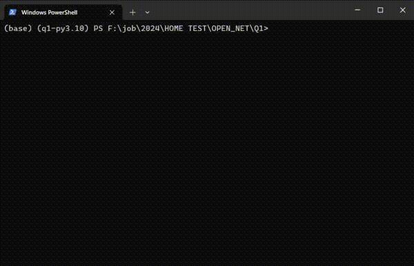

## Description
A python multithreading project. Simulate a producer-consumer

## Configuration
Modify config.ini
```
[General]
queue_size = 10
producer_num = 2
consumer_num = 3
produce_speed = 0.1
consume_speed = 0.15
```

## Installing

### From Source
1. Install poetry:
```sh
pip install poetry
```

2. Install dependencies:
```sh
poetry install
```

3. Run:
```sh
poetry run python main.py
```

### Using docker

1. Build the Docker Image:
```sh
docker build -t quest1 .
```

2. Start the Docker container:
```sh
docker run -d --rm --name quest1 quest1
```

## Demo
